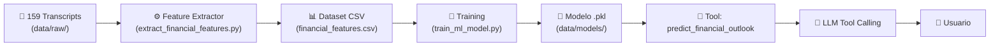
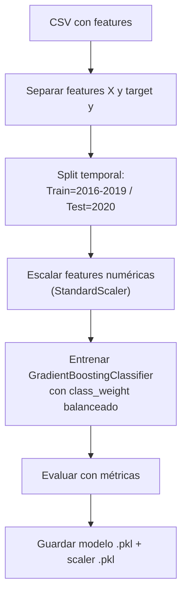

# Decisión Final + Guía de Implementación: Componente ML

## 1. El Caso Práctico Elegido

**Clasificación binaria del outlook financiero**: dado el transcript de una earnings call, el modelo ML predice si el **revenue de la empresa en el siguiente trimestre subirá o bajará** respecto al trimestre actual.

### ¿Por qué este caso práctico y no otro?

Se evaluaron 5 opciones posibles. La siguiente tabla resume por qué esta es la mejor:

| Opción evaluada | Problema principal | Veredicto |
|---|---|---|
| **A. Clasificación outlook (ELEGIDA)** | — | ✅ Target verificable, métricas claras, datos suficientes |
| B. Clustering (no supervisado) | No tiene target → no hay métricas objetivas → difícil de evaluar y defender | ❌ |
| C. Clasificación multiclass | Con ~160 muestras y 4 clases → ~40 por clase, demasiado poco | ❌ |
| D. Detección de anomalías | Solo ~16 transcripts por empresa → base de referencia insuficiente | ❌ |
| E. Regresión del revenue | *(ver sección siguiente)* | ❌ |

### ¿Por qué clasificación y no regresión del revenue?

ChatGPT propuso regresión (predecir el valor numérico exacto del revenue). Es tentador porque "predice un número", pero hay razones técnicas para descartarlo:

1. **Escala entre empresas**: AAPL factura ~$60B/Q y AMD ~$1.5B/Q. En regresión, mezclar estas escalas requiere normalización compleja o entrenar modelos separados (con solo 16 muestras por empresa, inviable). En clasificación, "sube" o "baja" es comparable entre todas las empresas.

2. **Métricas de evaluación**: Un clasificador con accuracy del 70% es un resultado académico razonable. Un regresor con R² de 0.2 parece un fracaso, aunque técnicamente extraiga señal similar del texto.

3. **Robustez al error**: Si el parser de revenue falla en un transcript, en clasificación perdemos una muestra pero el modelo funciona. En regresión, un valor mal parseado ($5.8 en vez de $58B) puede distorsionar todo el modelo.

4. **Utilidad como tool**: "El modelo predice outlook **POSITIVO** con 73% de confianza" es un output claro y útil. "El modelo predice **$62.3B**" con una desviación de ±$8B parece irresponsable.

### ¿Cómo encaja en el RAG?

En sistemas RAG de producción, el patrón estándar es que el LLM actúe como **orquestador** que selecciona tools según la intención del usuario. Nuestro sistema ya tiene 2 tools (retrieval y listado). El modelo ML se añade como **3ª tool** — un patrón real usado en plataformas como LangChain y LlamaIndex:

- **RAG tool** → responde preguntas sobre datos **pasados** ("¿qué dijo Tim Cook?")
- **ML tool** → genera **predicciones** basadas en patrones aprendidos ("¿cómo ves el futuro de Apple?")

Esta separación de responsabilidades (retrieval vs. prediction) es exactamente lo que se hace en producción.

---

## 2. Alineación con Requisitos Académicos (Compliance Check)

Este diseño cumple punto por punto con los requisitos solicitados por la dirección académica:

| Requisito Académico | Implementación en este proyecto |
|---|---|
| **Recoger dataset (kaggle)** | Usamos los **159 transcripts propios** del proyecto (mejor calidad y relevancia que un dataset genérico de Kaggle). |
| **EDA (Exploración)** | Se incluye un script dedicado y un paso explícito para analizar distribuciones y calidad antes de entrenar (Paso 3). |
| **Variables Objetivo** | Binary classification: `next_quarter_revenue_up` (1 si sube, 0 si baja). Variable clara y derivada de datos reales. |
| **Limpieza y Ruido** | El extractor imputa valores faltantes con la media y descarta outliers extremos. El EDA verifica la calidad. |
| **Tipo de Modelo** | **GradientBoostingClassifier**: Robusto, interpretable y eficaz con datasets pequeños-medianos (mejor que redes neuronales aquí). |
| **Split Train/Val** | **Split Temporal 80/20**: Usamos 2016-2019 para train (~80%) y 2020 para validación (~20%). Esto evita "leer el futuro" (data leakage). |
| **Integración Pipeline** | El modelo se expone como una **Tool** que el LLM orquesta automáticamente. |

---

## 3. Datos Disponibles (Auditoría Final)

| Recurso | Ubicación | Contenido |
|---|---|---|
| **Transcripts crudos** | `data/raw/Transcripts/<TICKER>/*.txt` | 159 ficheros, 10 empresas, 2016–2020 |
| **Corpus procesado** | `data/processed/corpus.jsonl` | 70 documentos (solo 2019–2020, usado por el RAG) |
| **Vector DB** | `data/indexes/unified_store.db` | 6.176 chunks embedidos (para retrieval) |

### Distribución por empresa

Las 10 empresas con sus tickers: AAPL, AMD, AMZN, ASML, CSCO, GOOGL, INTC, MSFT, MU, NVDA — cada una con ~16 transcripts (4 Q/año × 4-5 años).

### Formatos de los transcripts

| Formato | Empresas | Sección financiera |
|---|---|---|
| **Event Brief** | AAPL | Sección `FINANCIAL DATA` explícita con datos estructurados (Revenue, EPS, GM, etc.) |
| **Event Transcript** | MSFT, NVDA, GOOGL, AMD, etc. | Datos financieros embebidos en la narrativa de la presentación |

**Hallazgo clave**: Aunque los formatos son distintos, **ambos contienen menciones de revenue parseables por regex**. Frases como `"revenue was $X.X billion"`, `"total revenue of $X billion"` aparecen consistentemente en todas las empresas. Esto fue verificado con búsqueda en los 159 ficheros.

### Muestras para el modelo

- 159 transcripts totales
- -10 (último transcript de cada empresa → sin target conocido, se usan para predicción en runtime)
- = **~149 muestras con target verificable**
- **Balance de clases esperado**: ~55-65% positivas (mercados alcistas 2016-2020), manejable con `class_weight='balanced'`

---

## 4. Tecnología ML Elegida: scikit-learn

### ¿Por qué scikit-learn y no otras librerías?

| Tecnología | Decisión | Justificación |
|---|---|---|
| **scikit-learn** | ✅ **ELEGIDA** | Estándar de la industria para ML clásico, modelos interpretables, pipelines integradas, métricas completas, documentación excelente |
| TensorFlow / PyTorch | ❌ | Redes neuronales necesitan miles-millones de muestras. Con ~149 muestras, sobreajustarían |
| XGBoost / LightGBM | ❌ | Potentes pero añaden dependencia externa innecesaria. Scikit-learn tiene `GradientBoostingClassifier` nativo, suficiente aquí |
| Hugging Face Transformers | ❌ | Fine-tuning de modelos de lenguaje necesita GPUs y mucho más datos. Además, ya usamos embeddings (all-MiniLM-L6-v2) para el RAG |

### Tecnologías complementarias

| Librería | Uso | ¿Por qué esta? |
|---|---|---|
| **TextBlob** | Análisis de sentimiento del texto | Simple, bien documentada, suficiente para sentiment scoring académico. VADER sería la alternativa (más orientada a finanzas), pero TextBlob es más ligera |
| **pandas** | Manipulación del dataset de features | Estándar absoluto para datos tabulares en Python |
| **joblib** | Serialización del modelo (.pkl) | Incluida con scikit-learn, optimizada para objetos numpy |

---

## 5. El Modelo ML: GradientBoostingClassifier

### ¿Por qué este modelo y no otro?

| Modelo | Ventajas | Inconvenientes | Veredicto |
|---|---|---|---|
| LogisticRegression | Muy simple, interpretable, rápido | Asume relaciones lineales → pierde interacciones entre features | ⚠️ Bueno como baseline |
| RandomForest | Robusto a overfitting, feature importance | Menos preciso que Gradient Boosting con pocos datos | ⚠️ Alternativa viable |
| **GradientBoosting** | **Aprende de errores iterativamente**, captura no-linealidades, feature importance, funciona bien con **pocos datos** | Un poco más lento de entrenar (irrelevante con 149 muestras) | ✅ **ELEGIDO** |
| SVM | Buen rendimiento con pocos datos | No da probabilidades nativas (necesita calibración), menos interpretable | ❌ |
| Red Neuronal | Potente con muchos datos | **Necesita miles de muestras mínimo**, caja negra | ❌❌ |

### ¿Cómo funciona GradientBoosting internamente?

```
Iteración 1: Entrena un árbol de decisión pequeño → Calcula errores
Iteración 2: Entrena OTRO árbol que intenta corregir los errores del anterior
Iteración 3: Otro árbol que corrige los errores residuales
...
Iteración N: Ensamble de N árboles que se complementan entre sí
```

Es como tener un equipo de analistas donde cada uno se especializa en los casos que los anteriores fallaron. Esto lo hace especialmente bueno con datasets pequeños porque **cada árbol se enfoca en las muestras difíciles**.

---

## 6. Flujo Completo Paso a Paso

### Diagrama general



### Paso 1: Extracción de Features (`scripts/ml/extract_financial_features.py`)

**Entrada**: Los 159 ficheros `.txt` de `data/raw/Transcripts/`

**Proceso**: Por cada transcript, extraer un vector de 10 features:

| # | Feature | Cómo se extrae | Tipo |
|---|---|---|---|
| 1 | `company` | Del directorio padre (AAPL, MSFT, etc.) | string |
| 2 | `date` | Del nombre del fichero (2019-Apr-30) | date |
| 3 | `sentiment_score` | TextBlob sobre la sección Presentation | float [-1, 1] |
| 4 | `word_count_positive` | Conteo de palabras como: *growth, record, strong, exceeded, momentum, accelerating, robust* | int |
| 5 | `word_count_negative` | Conteo de palabras como: *decline, headwind, challenge, uncertainty, weakness, deceleration, unfavorable* | int |
| 6 | `confidence_ratio` | `pos / (pos + neg + 1)` | float [0, 1] |
| 7 | `revenue_current` | Regex: `revenue (was|of) \$X.X (billion|million)` → normalizado a billions | float |
| 8 | `revenue_growth_mentioned` | Regex: `(up|down|grew|declined) X%` cerca de "revenue" | float |
| 9 | `guidance_direction` | Heurística: buscar palabras de guidance alcista/bajista | int (-1, 0, +1) |
| 10 | `word_count_total` | Longitud total del texto (proxy de transparencia) | int |

**Salida**: `data/processed/financial_features.csv` con **159 filas** × 10 columnas

### Paso 2: Creación del Target

**El target (`next_quarter_positive`)** se construye así:

1. Ordenar transcripts por empresa → fecha
2. Para cada fila, mirar el revenue del **siguiente** transcript de la misma empresa
3. Si `revenue_next > revenue_current` → target = 1 (positivo)
4. Si `revenue_next <= revenue_current` → target = 0 (negativo)
5. El **último** transcript de cada empresa no tiene target (es el que usaremos para predicciones en producción)

### Paso 3: Entrenamiento (`scripts/ml/train_ml_model.py`)



**¿Por qué split temporal y no aleatorio?**

En datos financieros, el split aleatorio produce **data leakage temporal**: el modelo podría entrenar con Q3-2019 y testear con Q1-2019, aprendiendo "del futuro". El split temporal garantiza que **nunca vemos el futuro durante el entrenamiento**.

- **Train**: 2016, 2017, 2018, 2019 (~120 muestras, 80%)
- **Test**: 2020 (~29 muestras, 20%)

> **Decisión de Diseño**: Se valoró usar también 2019 para validación, pero se descartó porque dejaría el set de entrenamiento con solo el ~50% de los datos, aumentando el riesgo de *underfitting*. El split 80/20 es el balance óptimo para este volumen de datos.

**Métricas de evaluación**: Accuracy, F1-Score, Confusion Matrix.

**Salida**: `data/models/sentiment_model.pkl` + `data/models/feature_scaler.pkl`

### Paso 4: Predictor Runtime (`src/rag/ml/predictor.py`)

Clase `FinancialPredictor` que carga el modelo `.pkl` y ejecuta el pipeline completo en tiempo real.

### Paso 5: Integración como Tool

El LLM puede invocar la tool `predict_financial_outlook` cuando detecta intención predictiva.

---

## 7. Ejemplo End-to-End: Del Usuario al ML y de vuelta

### Escenario: Un usuario pregunta sobre el futuro de Apple

```
👤 Usuario: "¿Cómo ves el futuro financiero de Apple?"
```

**Paso 1 — El LLM decide qué tool usar**

El LLM lee la pregunta, reconoce intención predictiva ("futuro", "cómo ves") y decide llamar a la tool ML:

```json
{
  "function": {
    "name": "predict_financial_outlook",
    "arguments": "{\"company_id\": \"AAPL\"}"
  }
}
```

**Paso 2 — ToolManager ejecuta la llamada**

`ToolManager.execute_tool_call()` → `FinancialPredictor.predict("AAPL")`

**Paso 3 — El Predictor procesa**

1. Busca el último transcript de AAPL: `2020-Jul-30-AAPL.txt`
2. Extrae features del texto:
   - Sentiment score: **0.15** (ligeramente positivo)
   - Palabras positivas: **47** (record, growth, strong...)
   - Palabras negativas: **12** (decline, challenge...)
   - Confidence ratio: **0.78**
   - Revenue: **$59.7B**
   - Guidance direction: **+1** (alcista)
3. Normaliza con el scaler entrenado
4. Pasa por el GradientBoosting → **Predicción: POSITIVO (73% confianza)**

**Paso 4 — El resultado vuelve al LLM**

```json
{
  "company": "AAPL",
  "prediction": "POSITIVE",
  "confidence": 0.73,
  "key_factors": {
    "sentiment_score": 0.15,
    "revenue_current_B": 59.7,
  }
}
```

**Paso 5 — El LLM genera la respuesta final**

```
🤖 LLM: "Basándome en el análisis ML de la última earnings call de Apple,
el modelo predice un outlook POSITIVO con un 73% de confianza."
```

---

## 11. Guía de Ejecución (Checkpoints del Proyecto)

Esta sección sirve como checklist maestro para seguir el progreso de la implementación.

### Paso 1: Instalar Dependencias
- [x] Añadir librerías a `requirements.txt` (scikit-learn, textblob, matplotlib, etc.).
- [x] Ejecutar `pip install`.
- [x] Descargar corpus de NLP (`python -m textblob.download_corpora`).

### Paso 2: Crear el Extractor de Features
- [x] Crear script `scripts/ml/extract_financial_features.py`.
- [x] Implementar lógica de TextBlob y Diccionario Financiero.
- [x] Extraer features de los 159 transcripts a `data/processed/financial_features.csv`.

### Paso 3: Análisis Exploratorio de Datos (EDA)
- [ ] Crear script `scripts/ml/analyze_data.py`.
- [ ] Generar estadísticas y gráficos de distribución.
- [ ] Verificar calidad de datos y limpiar si es necesario.

### Paso 4: Entrenamiento del Modelo
- [ ] Crear script `scripts/ml/train_ml_model.py`.
- [ ] Implementar split temporal (Train < 2020, Val = 2020).
- [ ] Entrenar GradientBoostingClassifier.
- [ ] Guardar modelo `.pkl` y scaler.

### Paso 5: Predictor Runtime
- [ ] Implementar clase `FinancialPredictor` en `src/rag/ml/predictor.py`.
- [ ] Conectar carga de modelo y lógica de inferencia.

### Paso 6: Integración en el RAG
- [ ] Registrar tool en `src/rag/generation/tools.py`.
- [ ] Actualizar prompts del sistema.

### Paso 7: Verificación
- [ ] Tests unitarios.
- [ ] Prueba manual end-to-end en el chat.
