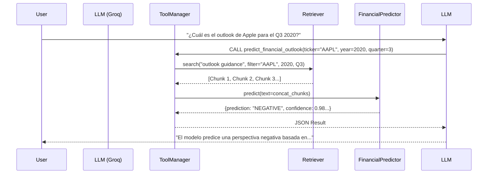

# Paso 6: Integración como Tool en el RAG

## 1. Estrategia de Integración
Hemos transformado el modelo de ML en una **Herramienta Cognitiva** que el LLM puede usar a voluntad. En lugar de ejecutar el script manualmente, ahora el asistente decide cuándo llamar al predictor.

### Componentes Modificados
1.  **`src/rag/generation/tools.py`**:
    *   **Nuevo Schema**: `PREDICT_OUTLOOK_TOOL_SCHEMA`. Define los inputs necesarios: `query`, `company_id`, `year`, `quarter`.
    *   **ToolManager Actualizado**: Ahora inicializa tanto el `Retriever` como el `FinancialPredictor`.
    *   **Método `predict_financial_outlook`**: Orquesta el flujo:
        1.  Recibe la intención del usuario (ej: "Apple guidance 2020").
        2.  Usa `self.retriever` para buscar los párrafos relevantes en la base de datos vectorial.
        3.  Concatena estos párrafos para formar un "mini-transcript" enfocado.
        4.  Pasa este texto a `self.predictor` (junto con el trimestre) para obtener el análisis.
        5.  Devuelve el JSON con la predicción, confianza y factores clave.

2.  **`src/rag/core/prompts.py`**:
    *   Se instruyó al System Prompt para que use esta herramienta **SOLO** cuando el usuario pregunte por futuro, outlook, guidance o predicciones.

## 2. Flujo de Ejecución (Runtime)

## 3. Ventajas de esta Arquitectura
*   **Contexto Dinámico**: El modelo no predice sobre *todo* el documento, sino sobre los fragmentos que el Retriever considera relevantes para la pregunta del usuario (más preciso).
*   **Transparencia**: El LLM recibe los `key_factors` (palabras positivas/negativas encontradas), por lo que puede explicar *por qué* la predicción es esa.

## 4. Siguiente Paso
**Paso 7**: Crear un test unitario (`tests/test_ml_predictor.py`) para asegurar que esta integración no se rompa con cambios futuros.
