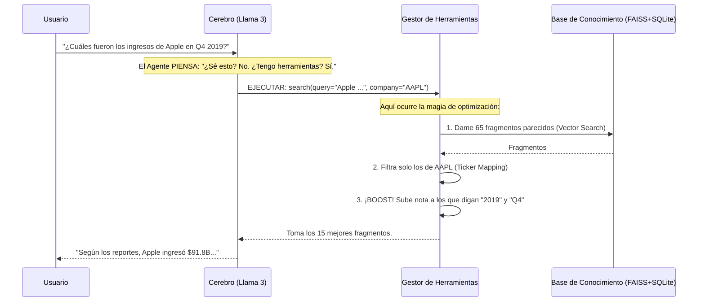

# 🏗️ Arquitectura del Sistema RAG — Earnings Calls NASDAQ

Este documento explica **cómo funciona** la aplicación y **por qué** elegimos cada tecnología. Diseñado para entender el flujo completo de un sistema de IA financiera.

---

## 1. Visión General: ¿Qué hemos construido?

Hemos creado un **Agente Financiero Inteligente** que no solo conversa, sino que tiene acceso a una base de datos de conocimientos reales (Transcripts 2019-2020) para responder preguntas con datos verídicos.

### La Filosofía: "Tool Calling" vs RAG Tradicional
*   **Antes (RAG Clásico)**: El sistema *siempre* buscaba información, incluso si solo decías "Hola". Era ineficiente.
*   **Ahora (Agentic RAG)**: Usamos un cerebro (LLM) que **decide** cuándo usar herramientas.
    *   *Usuario*: "Buenos días" -> *Agente*: "Hola" (Sin búsqueda).
    *   *Usuario*: "¿Dato de Apple?" -> *Agente*: "Uso herramienta `search_earnings_calls`".

---

## 2. Pila Tecnológica (The "Why")

Cada pieza del puzzle ha sido elegida por una razón técnica y estratégica:

| Componente | Tecnología | ¿Por qué esta y no otra? |
|------------|------------|--------------------------|
| **Cerebro (LLM)** | **Llama 3.3 70B** (Groq) | Porque es **Open Source** pero tiene rendimiento de GPT-4. Usamos **Groq** porque su inferencia es casi instantánea (<1s), vital para un chat fluido. |
| **Búsqueda Vectorial** | **FAISS** (Facebook AI) | Es el estándar de oro para búsqueda de similitud. Es local, rapidísimo y no necesita servidores externos complejos (como Pinecone) para este volumen de datos. |
| **Metadatos** | **SQLite** | Una base de datos SQL completa en un solo archivo. Perfecta para guardar los textos y metadatos (Año, Trimestre, Empresa) sin configurar un servidor PostgreSQL/MySQL. |
| **Embeddings** | **MiniLM-L6-v2** | Un modelo pequeño y rápido que corre bien en CPU. Convierte texto a números (vectores) con gran precisión semántica sin necesitar GPU. |
| **Orquestación** | **Python (Nativo)** | No usamos LangChain ni LlamaIndex. Hemos construido el pipeline "a mano" para tener **control total**, evitar abstracciones mágicas y entender cada paso del flujo. |

---

## 3. Arquitectura del Pipeline (El Flujo de Datos)

### A. Ingesta (Offline - Preparación)
Antes de poder chatear, procesamos los datos crudos.
1.  **Load**: Leemos los JSONs de Kaggle.
2.  **Chunking**: Cortamos los discursos largos en trozos de ~1000 caracteres (para que quepan en el contexto del LLM).
3.  **Embedding**: Convertimos cada trozo a un vector de 384 números.
4.  **Indexing**: Guardamos el vector en FAISS y el texto en SQLite.

### B. Inferencia (Online - El Chat)

Este es el proceso que ocurre cuando tú preguntas algo. Fíjate en el diagrama del Agente:

---

## 4. Nuestras "Armas Secretas" (Optimizaciones)

Para que el sistema funcione tan bien como lo hace, implementamos tres lógicas clave en `tools.py`:

1.  **Ticker Mapping**: Si buscas "Google", el sistema sabe buscar "GOOGL". Si buscas "Alphabet", también. Hacemos de "traductor" entre el lenguaje humano y el bursátil.
2.  **Strict Filtering**: Si le pides datos de Apple, el sistema **prohíbe** terminantemente que pasen datos de Microsoft a la respuesta final. Eliminamos alucinaciones cruzadas.
3.  **Metadata Boost (Nuestro "Reranker")**: 
    *   Las bases de datos vectoriales a veces fallan con números específicos (como años).
    *   Nosotros forzamos matemáticamente: "Si el usuario dijo 2019, y este papel dice 2019, dale un +5% de relevancia". 
    *   Esto garantiza que el dato exacto aparezca siempre arriba.

---

## 5. Estructura del Código: ¿Dónde está cada cosa?

Hemos diseñado el código siguiendo el principio de **"Separation of Concerns"** (Separación de Responsabilidades). Cada carpeta tiene un trabajo único:

### 🏭 `src/rag/pipeline/` (La Fábrica)
Aquí están los scripts ETL que **solo se ejecutan una vez** para preparar los datos.
*   `step1_loader.py`: Carga el JSONL crudo.
*   `step2_chunking.py`: Corta el texto en trozos (chunks).
*   `step3_embedding.py`: Convierte texto a números.
*   `step4_indexing.py`: Guarda todo en FAISS y SQLite.

### 🔍 `src/rag/retrieval/` (El Detective)
Contiene la lógica pura de búsqueda, sin saber nada de IA o Chat.
*   `retriever.py`: El script que coordina FAISS y SQLite. Aquí vive el algoritmo que recupera los datos crudos.

### 🧠 `src/rag/generation/` (El Cerebro)
Donde ocurre la magia de la Inteligencia Artificial.
*   `llm_groq.py`: El "Camarero". Habla con la API de Groq y gestiona el historial de chat.
*   `tools.py`: La "Caja de Herramientas". Aquí están definidas `search_earnings_calls` y `list_available_companies`. **Aquí vive la lógica de Metadata Boost y Ticker Mapping.**

### 💾 `src/rag/storage/` (La Memoria)
Drivers de bajo nivel para conectar con las bases de datos.
*   `vector_store.py`: Maneja el archivo `.index` de FAISS.
*   `metadata_store.py`: Maneja el archivo `.db` de SQLite.

### ⚙️ `src/rag/core/` (Los Cimientos)
Configuraciones globales y tipos de datos.
*   `config.py`: Variables como API Keys, rutas de archivos y constantes.
*   `schema.py`: Define qué es un `Chunk`, un `Document`, etc. para que todo el código hable el mismo idioma.
