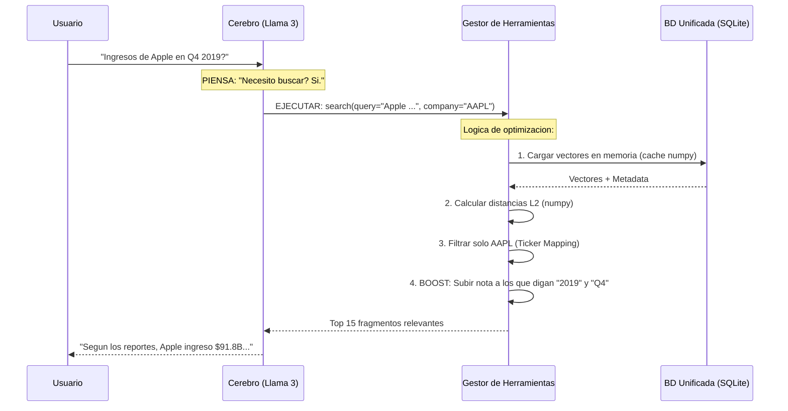

# Arquitectura del Sistema RAG - Earnings Calls NASDAQ

Este documento explica **como funciona** la aplicacion y **por que** elegimos cada tecnologia.

---

## 1. Vision General

Un **Agente Financiero Inteligente** que tiene acceso a una base de datos de conocimientos reales (Transcripts 2019-2020) para responder preguntas con datos veridicos.

### La Filosofia: "Tool Calling" vs RAG Tradicional
*   **RAG Clasico**: El sistema *siempre* buscaba informacion, incluso si solo decias "Hola". Ineficiente.
*   **Agentic RAG (actual)**: Un cerebro (LLM) que **decide** cuando usar herramientas.
    *   *Usuario*: "Buenos dias" -> *Agente*: "Hola" (Sin busqueda).
    *   *Usuario*: "Dato de Apple?" -> *Agente*: "Uso herramienta `search_earnings_calls`".

---

## 2. Pila Tecnologica

| Componente | Tecnologia | Por que |
|------------|------------|---------|
| **Cerebro (LLM)** | **Llama 3.3 70B** (Groq) | Open Source con rendimiento de GPT-4. Groq: inferencia casi instantanea (<1s). |
| **Base de Datos** | **SQLite (unificada)** | Un solo archivo `.db` con texto, metadata Y vectores como BLOBs. Sin FAISS. Sin servidores. |
| **Embeddings** | **MiniLM-L6-v2** | Modelo rapido en CPU. Convierte texto en vectores de 384 dimensiones. |
| **Orquestacion** | **Python (Nativo)** | Sin LangChain ni LlamaIndex. Pipeline construido a mano para control total. |

---

## 3. Arquitectura del Pipeline

### A. Ingesta (Offline - Preparacion)
1.  **Load**: Leemos los JSONs de Kaggle (`prepare_corpus.py`).
2.  **Chunking**: Cortamos los transcripts en trozos de ~1000 caracteres.
3.  **Embedding**: Convertimos cada trozo a un vector de 384 dimensiones.
4.  **Indexing**: Guardamos texto + metadata + vector en la BD SQLite unificada.

### B. Inferencia (Online - El Chat)



---

## 4. Optimizaciones Clave

1.  **Ticker Mapping**: Si buscas "Google", el sistema sabe buscar "GOOGL". Si buscas "Alphabet", tambien.
2.  **Strict Filtering**: Si pides datos de Apple, el sistema impide que pasen datos de Microsoft.
3.  **Metadata Boost (Reranker)**:
    *   Si el usuario dijo "2019" y un chunk es de 2019: +5% de relevancia.
    *   Si menciono "Q4" y el chunk es Q4: +3%.

---

## 5. Estructura del Codigo

```text
src/rag/
  core/          # Configuracion y esquemas (config.py, schema.py, prompts.py, memory.py)
  pipeline/      # ETL: Loader, Chunking, Embedding, Indexing (steps 1-4)
  storage/       # BD unificada SQLite (unified_store.py)
  retrieval/     # Motor de busqueda semantica (retriever.py)
  generation/    # LLM Groq + Tool Calling (llm_groq.py, tools.py)

scripts/
  prepare_corpus.py      # Prepara corpus.jsonl desde datos crudos
  run_full_indexing.py   # Pipeline completo de indexado
  chat_cli.py            # Interfaz de chat interactiva
  evaluate_retrieval.py  # Evaluacion end-to-end
  kaggle_download.py     # Descarga datasets de Kaggle
```
