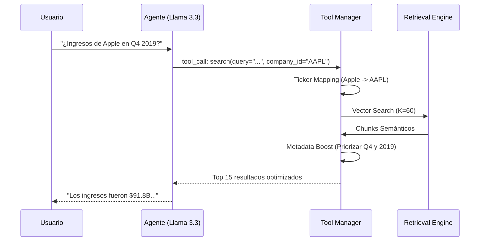

# 🏗️ Arquitectura del Sistema RAG — Earnings Calls

## 1. Concepto de "Agente RAG"

A diferencia de un RAG tradicional que siempre busca información, este sistema actúa como un **Agente**. El LLM tiene acceso a herramientas y decide cuál usar según la intención del usuario.

### 🛠️ Herramientas Disponibles
- `list_available_companies`: Permite al asistente saber qué datos tiene el índice sin tener que adivinar.
- `search_earnings_calls`: Realiza la búsqueda profunda con filtros inteligentes.

---

## 2. Flujo de Información (Diagrama)

### 🔍 Proceso de Consulta Optimizado

---

## 3. Optimizaciones de Recuperación (Recap)

Para garantizar que el asistente no se pierda entre miles de párrafos, hemos implementado tres capas de optimización:

### 🚀 A. Metadata Boost
Cuando el sistema detecta un año (ej: `2019`) o trimestre (`Q1-Q4`) en la pregunta, aplica un **boost de puntuación** a los fragmentos que coinciden exactamente con esos metadatos. Esto asegura que la información temporal sea la primera en aparecer.

### 🎯 B. Ticker Mapping
El sistema traduce automáticamente nombres de empresas populares a sus códigos bursátiles (tickers). 
- *Ejemplo*: El usuario pregunta por "Microsoft" -> Internamente filtramos por el ticker `MSFT`.

### 🧪 C. Reordenamiento (Ordering Fix)
Corregimos un bug crítico donde el orden de los resultados de la base de datos vectorial se perdía al consultar la base de datos de texto. Ahora la relevancia se mantiene estrictamente desde el primer hasta el último resultado.

---

## 4. Estructura de Datos (Storage)

| Componente | Tipo | Función |
|------------|------|---------|
| **FAISS** | Vector Index | Almacena los embeddings para búsqueda semántica instantánea. |
| **SQLite** | RDBMS | Guarda el texto original, fuentes y metadatos (año, trimestre, empresa). |

---

## 5. Modelos Utilizados

- **Modelos de Lenguaje**: `Llama 3.3 70B Versatile` vía Groq API (Inferencia < 1s).
- **Embeddings**: `All-MiniLM-L6-v2` (Sentence Transformers).
