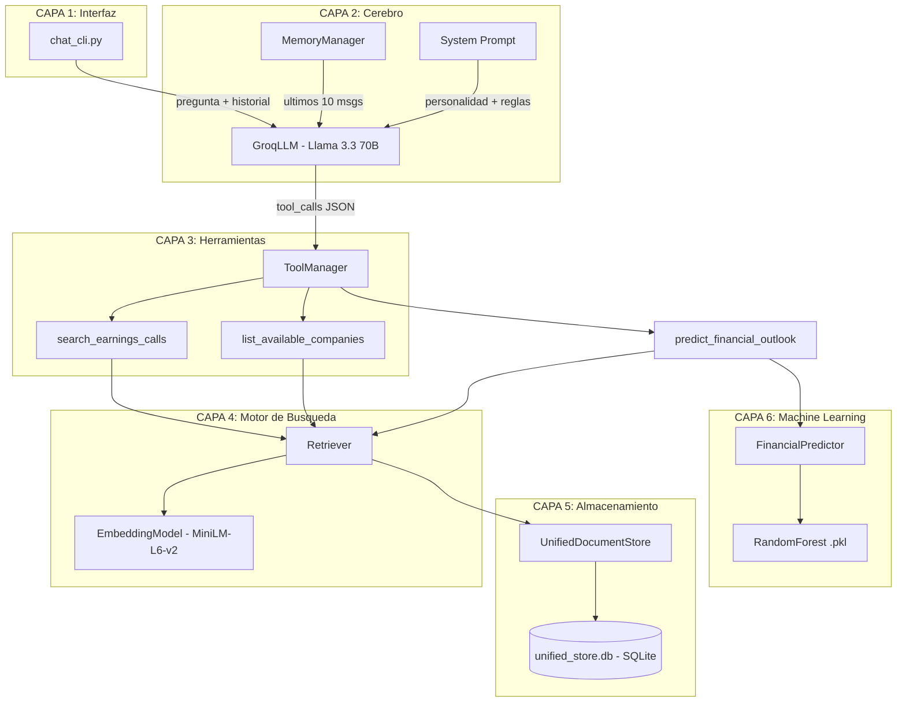
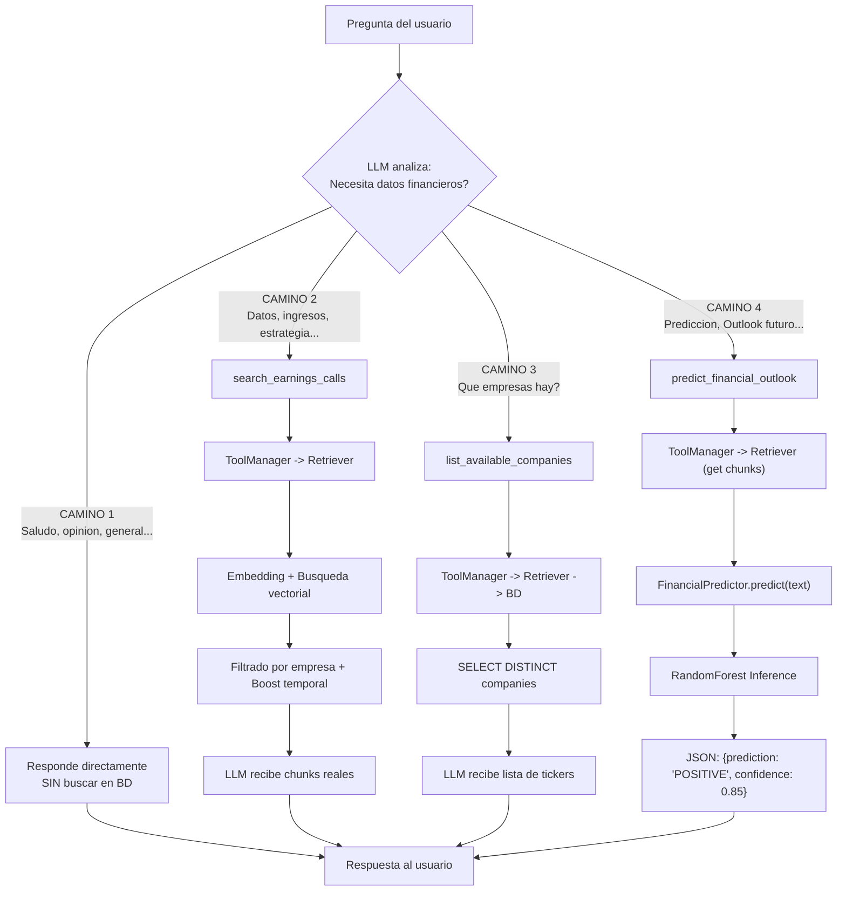
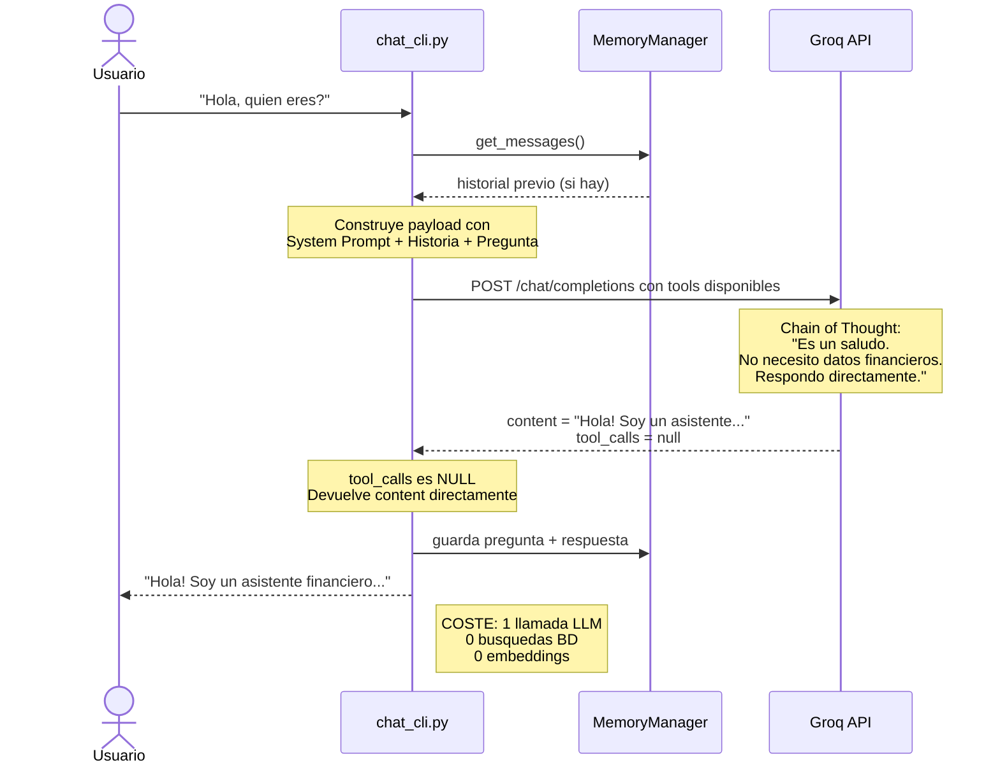
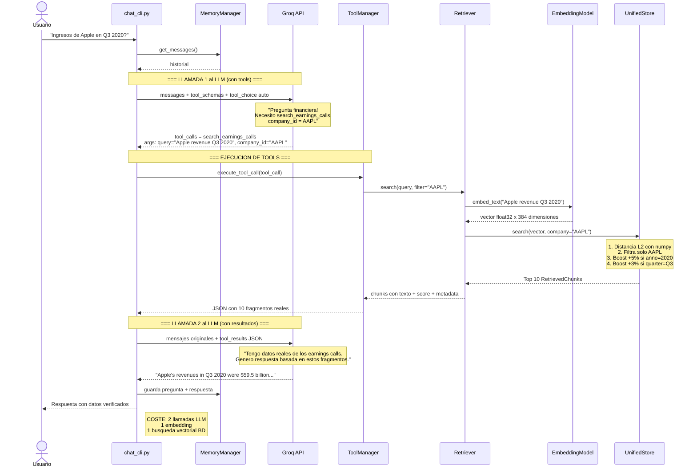
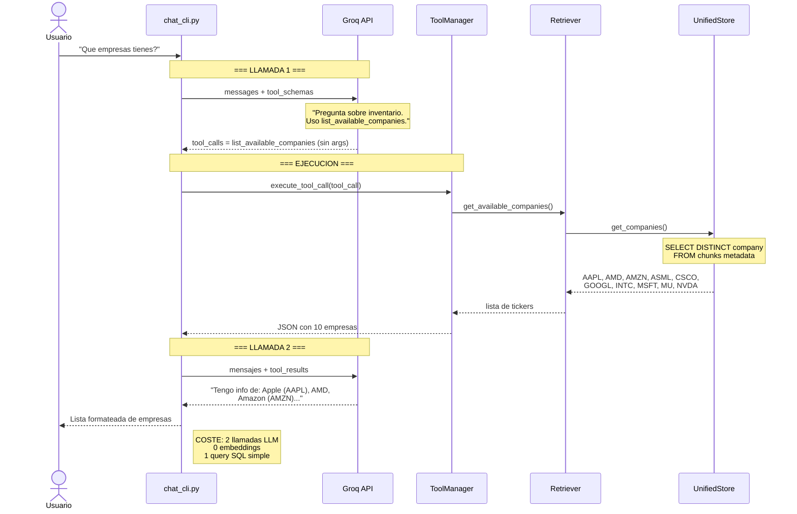
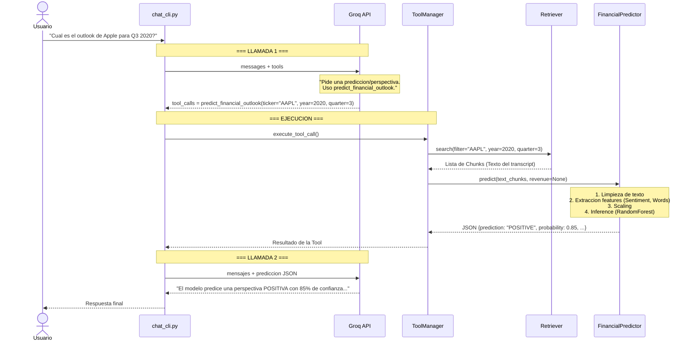
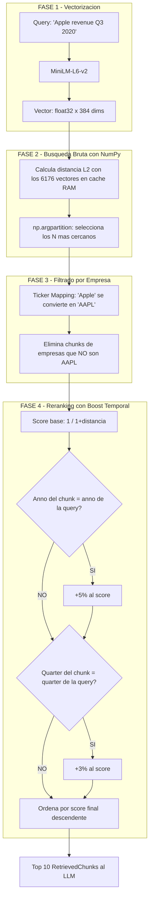
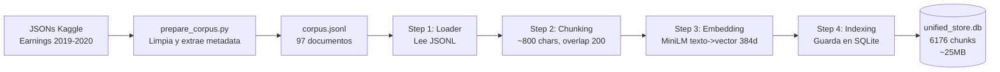
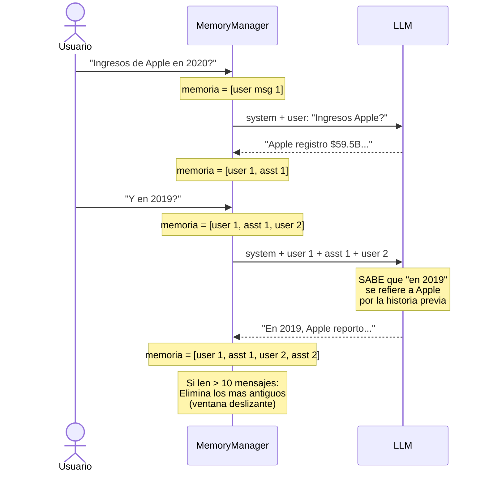

# Arquitectura del Sistema RAG - Earnings Calls NASDAQ

## 1. Mapa de Componentes

El sistema tiene **6 componentes principales** organizados en 5 capas:



**Que hace cada capa:**

| Capa | Componente | Responsabilidad |
|------|-----------|-----------------|
| 1. Interfaz | `chat_cli.py` | Lee preguntas del usuario, muestra respuestas |
| 2. Cerebro | `GroqLLM` + `MemoryManager` + `System Prompt` | Decide si usar tools, genera respuestas, recuerda contexto |
| 3. Herramientas | `ToolManager` + 2 tools | Enruta las peticiones del LLM al componente correcto |
| 4. Busqueda | `Retriever` + `EmbeddingModel` | Convierte texto a vectores y coordina la busqueda semantica |
| 5. Almacenamiento | `UnifiedDocumentStore` + SQLite | Guarda y busca chunks (texto + metadata + vectores) |
| 6. Machine Learning | `FinancialPredictor` | Analiza sentimiento y genera predicciones de outlook (Pos/Neg) |

---

## 2. Flujo de Decision del LLM

Cada pregunta pasa por esta logica. Hay **4 caminos posibles**:



**Ejemplos reales por camino:**

| Camino | Ejemplo | Que pasa | Llamadas al LLM |
|--------|---------|----------|-----------------|
| 1 - Sin tools | "Hola, que tal?" | Responde directo. No toca la BD | 1 |
| 2 - Search | "Ingresos de Apple en Q3 2020?" | Busca en BD, filtra AAPL, devuelve chunks | 2 |
| 3 - List | "Que empresas tienes?" | Query SQL simple, devuelve tickers | 2 |
| 4 - Predict | "Cual es el outlook de Apple para 2020?" | Recupera texto -> ML Model -> Prediccion JSON | 2 |

---

## 3. Flujo Detallado: Camino 1 — Sin Tools

Cuando el LLM decide que **NO necesita** buscar en la base de datos:



---

## 4. Flujo Detallado: Camino 2 — search_earnings_calls

Este es el flujo **mas complejo**. El LLM hace **2 llamadas**:



---

## 5. Flujo Detallado: Camino 3 — list_available_companies

El mas simple de los que usan tools:



---

## 6. Flujo Detallado: Camino 4 — Prediccion Financiera (ML)

Integra RAG clásico con un modelo de clasificación:



---

## 6. La Busqueda Vectorial en Detalle

Cuando `search_earnings_calls` se ejecuta, hay **4 fases internas**:



### Ticker Mapping Completo

El sistema traduce nombres comunes a tickers automaticamente:

| El usuario dice... | El sistema busca... |
|--------------------|---------------------|
| "Apple", "apple" | AAPL |
| "Google", "Alphabet" | GOOGL |
| "Microsoft" | MSFT |
| "Amazon" | AMZN |
| "NVIDIA", "Nvidia" | NVDA |
| "Intel" | INTC |
| "AMD" | AMD |
| "Micron" | MU |
| "ASML" | ASML |
| "Cisco" | CSCO |

---

## 7. Las 3 Herramientas (Tool Schemas)

El LLM recibe estas definiciones en **cada llamada**. Son su "menu":

### Tool 1: `search_earnings_calls`

| Campo | Valor |
|-------|-------|
| **Cuando usarla** | Cualquier pregunta sobre datos financieros, ingresos, estrategia, CEO, earnings |
| **Parametro `query`** | Obligatorio. Pregunta o keywords. Ej: "Apple revenue Q4 2019" |
| **Parametro `company_id`** | Opcional pero recomendado. Ticker o nombre. Ej: "AAPL", "Apple" |
| **Parametro `num_results`** | Opcional (default 10). Cuantos fragmentos devolver |
| **Retorna** | JSON array: `[{company, year, quarter, content, score}]` |

### Tool 2: `list_available_companies`

| Campo | Valor |
|-------|-------|
| **Cuando usarla** | Solo si preguntan "que empresas tienes?" |
| **Parametros** | Ninguno |
| **Retorna** | JSON array de tickers: `["AAPL", "AMD", ...]` |

### Tool 3: `predict_financial_outlook` (NUEVA)

| Campo | Valor |
|-------|-------|
| **Cuando usarla** | Preguntas sobre futuro, predicciones, outlook, perspectivas |
| **Parametros** | `company_id` (str), `year` (int), `quarter` (int) |
| **Retorna** | JSON: `{"prediction": "POSITIVE", "probability": float, "features": {...}}` |

### Como decide el LLM?

Se le envia un **System Prompt** con instrucciones tipo Chain of Thought:

```
1. Analiza la pregunta. Pide datos especificos (ingresos, estrategia, CEO)?
2. SI -> USA search_earnings_calls. No respondas de memoria.
3. NO -> Responde directamente.
```

El parametro `tool_choice: "auto"` permite que el LLM decida libremente en cada turno.

---

## 8. Pipeline Offline (Ingesta - Solo una vez)

Se ejecuta con: `python scripts/run_full_indexing.py`



### Esquema de la Base de Datos

Toda la info vive en **una tabla, un archivo**:

| Columna | Tipo | Para que sirve |
|---------|------|----------------|
| `chunk_id` | TEXT PK | ID unico del fragmento |
| `doc_id` | TEXT | Transcript padre (ej: "AAPL_Q3_2020") |
| `text` | TEXT | Fragmento de texto real (~800 chars) |
| `chunk_index` | INTEGER | Posicion dentro del documento |
| `metadata` | TEXT (JSON) | `{"company":"AAPL", "year":"2020", "quarter":"Q3"}` |
| `embedding` | BLOB | Vector de 384 float32 (~1.5KB) |

---

## 9. La Memoria (Contexto Conversacional)

El `MemoryManager` mantiene una **ventana deslizante** de los ultimos 10 mensajes:



Esto permite **preguntas de seguimiento** sin repetir el contexto.

---

## 10. Pila Tecnologica

| Capa | Tecnologia | Justificacion |
|------|------------|---------------|
| **LLM** | Llama 3.3 70B via Groq API | Open Source, rendimiento top, inferencia <1s |
| **Embeddings** | all-MiniLM-L6-v2 | Rapido en CPU, 384 dims, buena calidad semantica |
| **Base de Datos** | SQLite (stdlib Python) | Un solo archivo, sin servidor, texto + vectores juntos |
| **Busqueda Vectorial** | NumPy (distancia L2 en RAM) | Simple, eficiente para ~6K vectores |
| **Interfaz** | CLI (Python input/print) | Rapido de iterar |
| **Orquestacion** | Python nativo | Control total, sin LangChain/LlamaIndex |
| **API HTTP** | requests | Llamadas directas a Groq |
| **Machine Learning** | scikit-learn | RandomForestClassifier, StandardScaler, TF-IDF/TextBlob |

---

## 11. Estructura de Archivos

```text
src/rag/
  core/
    config.py        # Rutas, constantes, modelos (centralizado)
    schema.py        # Dataclasses: Document, Chunk, RetrievedChunk
    prompts.py       # System prompt del LLM (chain of thought)
    memory.py        # Ventana deslizante de conversacion (10 msgs)
  pipeline/
    step1_loader.py      # Lee corpus.jsonl -> List of Documents
    step2_chunking.py    # Document -> Chunks (800 chars, 200 overlap)
    step3_embedding.py   # Texto -> vector de 384 dims (MiniLM)
    step4_indexing.py    # Chunks + vectors -> SQLite
  storage/
    unified_store.py     # BD unica: texto + metadata + vectores como BLOBs
  retrieval/
    retriever.py         # Coordina: ticker mapping + busqueda + boost
  generation/
    llm_groq.py          # Groq API wrapper + loop de tool calling (2 pasos)
    tools.py             # Schemas de 2 tools + ToolManager (router)

scripts/
  run_full_indexing.py   # Pipeline offline completo (steps 1-4)
  chat_cli.py            # Chat interactivo (punto de entrada)
  prepare_corpus.py      # Datos crudos Kaggle -> corpus.jsonl
```
