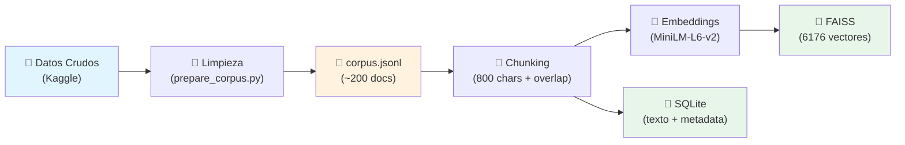
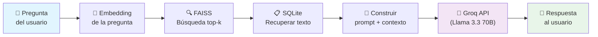

# 🏗️ Arquitectura del Sistema RAG — Earnings Calls NASDAQ

## 1. ¿Qué es este Proyecto?

Un **asistente financiero inteligente** capaz de leer y responder preguntas sobre transcripts de earnings calls (conferencias de resultados financieros) de empresas del NASDAQ, correspondientes a los años 2019-2020.

Utiliza la arquitectura **RAG (Retrieval-Augmented Generation)**: en lugar de depender únicamente de la memoria del LLM, el sistema busca la información relevante en una base de datos de documentos y la usa como contexto para generar respuestas precisas y fundamentadas.

### ¿Por qué RAG y no solo un LLM?

| Solo LLM | RAG |
|----------|-----|
| Puede inventar datos (alucinaciones) | Solo responde con datos reales del corpus |
| No tiene acceso a datos privados/propios | Busca en tu propia base de documentos |
| Conocimiento limitado al entrenamiento | Se actualiza añadiendo más documentos |

---

## 2. Diagrama de Arquitectura

### Pipeline de Indexación (offline — se ejecuta una vez)


### Pipeline de Consulta (online — cada pregunta del usuario)


---

## 3. Stack Tecnológico

| Componente | Tecnología | Justificación |
|------------|-----------|---------------|
| **Embeddings** | `sentence-transformers/all-MiniLM-L6-v2` | Modelo ligero (80MB), rápido en CPU, 384 dimensiones, ideal para búsqueda semántica |
| **Vector DB** | `FAISS` (Facebook AI Similarity Search) | Motor de búsqueda vectorial de referencia, búsqueda exacta L2, sin servidor externo |
| **Metadata DB** | `SQLite` | Base de datos embebida, sin servidor, perfecta para guardar textos y metadata de chunks |
| **LLM** | `Llama 3.3 70B Versatile` vía Groq API | Modelo potente para análisis financiero, acceso vía API con baja latencia |
| **Chunking** | Ventana fija (800 chars) con solape (100 chars) | Simple, efectivo, el solape evita cortar frases |
| **Lenguaje** | Python 3.x | Ecosistema dominante en ML/NLP |

---

## 4. Estructura del Proyecto

```
Arquitectura_rag_earnings_NSDQ/
│
├── 📁 data/
│   ├── raw/                     # Transcripts originales de Kaggle
│   ├── processed/
│   │   └── corpus.jsonl         # Documentos limpios y normalizados
│   └── indexes/
│       ├── vectors.index        # Índice FAISS (vectores)
│       ├── vectors.id_map.pkl   # Mapeo posición FAISS → chunk_id
│       └── metadata.db          # SQLite (texto + metadata)
│
├── 📁 src/
│   ├── ingest_transcripts.py    # Funciones de limpieza de texto y extracción de metadata
│   └── rag/
│       ├── config.py            # ⚙️ Configuración centralizada (rutas, modelos, parámetros)
│       ├── schema.py            # 📐 Dataclasses: Document, Chunk, RetrievedChunk
│       ├── ingest.py            # 📥 Carga corpus.jsonl → objetos Document
│       ├── chunking.py          # 🔪 Corta documentos en chunks con solape
│       ├── embeddings.py        # 🔢 Convierte texto → vectores (MiniLM)
│       ├── vdb_faiss.py         # 💾 Gestión del índice FAISS (add, search, save, load)
│       ├── vdb_sqlite.py        # 💾 Gestión de SQLite (insert, query, batch)
│       ├── retriever.py         # 🔍 Combina FAISS + SQLite para búsqueda semántica
│       └── llm_groq.py          # 🤖 Wrapper de Groq API (prompt + contexto → respuesta)
│
├── 📁 scripts/
│   ├── kaggle_download.py       # Descarga automatizada del dataset de Kaggle
│   ├── prepare_corpus.py        # Limpieza y normalización → corpus.jsonl
│   ├── build_index.py           # 🏭 Pipeline completo de indexación
│   └── chat_cli.py              # 💬 Chat interactivo por terminal
│
├── 📁 tests/
│   ├── test_ingest.py           # Test de carga de documentos
│   ├── test_chunking.py         # Test de chunking
│   ├── test_embeddings.py       # Test de generación de embeddings
│   ├── test_vdb.py              # Test de FAISS + SQLite
│   ├── test_retriever.py        # Test de búsqueda semántica
│   └── test_rag_pipeline.py     # Test end-to-end del pipeline
│
├── 📁 docs/
│   ├── architecture.md          # 📖 Este archivo
│   ├── project_roadmap.md       # Roadmap del proyecto
│   └── kaggle_setup.md          # Guía de configuración de Kaggle
│
├── .env                         # Variables de entorno (API keys)
├── .env.example                 # Plantilla de .env
├── .gitignore
├── requirements.txt             # Dependencias
└── README.md                    # Descripción general del proyecto
```

---

## 5. Pipeline Paso a Paso

### 5.1 Fase Offline: Preparación e Indexación

Esta fase se ejecuta **una sola vez** para construir la base de datos. Se ejecuta con `python scripts/build_index.py`.

#### Paso 1 — Descarga de datos
```
scripts/kaggle_download.py → data/raw/Transcripts/{AAPL,AMD,AMZN,...}/*.txt
```
Se descarga el dataset de earnings calls del NASDAQ desde Kaggle. Cada archivo `.txt` es un transcript completo de una conferencia de resultados.

#### Paso 2 — Limpieza y normalización
```
scripts/prepare_corpus.py + src/ingest_transcripts.py → data/processed/corpus.jsonl
```
- **`extract_metadata()`**: Extrae empresa, año, trimestre del nombre de archivo y contenido
- **`clean_text()`**: Normaliza espacios, elimina caracteres extraños
- **`generate_doc_id()`**: Crea un ID único y estable (hash MD5)
- Resultado: un archivo JSONL donde cada línea es `{"doc_id": "...", "text": "...", "metadata": {...}}`

#### Paso 3 — Ingesta
```python
# src/rag/ingest.py
documents = load_processed_corpus("data/processed/corpus.jsonl")
# → Lista de objetos Document(doc_id, text, metadata)
```

#### Paso 4 — Chunking
```python
# src/rag/chunking.py
chunks = chunk_documents(documents, chunk_size=800, overlap=100)
# 200 documentos → 6176 chunks
```
Cada documento se corta en trozos de 800 caracteres con un solape de 100. Esto permite que las búsquedas sean más precisas (trozos pequeños = más específicos) sin perder contexto en los bordes.

#### Paso 5 — Embeddings
```python
# src/rag/embeddings.py
embed_model = EmbeddingModel("sentence-transformers/all-MiniLM-L6-v2")
vectors = embed_model.embed_texts([chunk.text for chunk in batch])
# Cada texto → vector de 384 dimensiones
```
El modelo `all-MiniLM-L6-v2` convierte cada trozo de texto en un vector numérico de 384 dimensiones que captura su significado semántico. Textos con significados similares producen vectores cercanos.

#### Paso 6 — Almacenamiento dual
```python
# src/rag/vdb_faiss.py — Vectores
vector_db = VectorDB("data/indexes/vectors.index", dimension=384)
vector_db.add_vectors(embeddings, chunk_ids)
vector_db.save_index()

# src/rag/vdb_sqlite.py — Texto y metadata
meta_db = MetadataDB("data/indexes/metadata.db")
meta_db.upsert_chunks(chunks)
```

**¿Por qué dos bases de datos?**
- **FAISS** es extremadamente rápido buscando vectores similares, pero solo almacena números
- **SQLite** guarda el texto original y metadata (empresa, año, trimestre) que FAISS no puede guardar
- Se conectan mediante el `chunk_id`: FAISS devuelve IDs → SQLite devuelve el texto de esos IDs

---

### 5.2 Fase Online: Pregunta → Respuesta

Esta fase se ejecuta **cada vez que el usuario hace una pregunta** en el chat (`python scripts/chat_cli.py`).

#### Paso 1 — El usuario escribe una pregunta
```
💬 Tu pregunta: ¿Cuáles fueron los ingresos de Apple en 2020?
```

#### Paso 2 — Embedding de la pregunta
```python
# src/rag/retriever.py → EmbeddingModel
query_vector = embed_model.embed_text("¿Cuáles fueron los ingresos de Apple en 2020?")
# → Vector de 384 dimensiones
```
La pregunta se convierte al mismo espacio vectorial que los chunks.

#### Paso 3 — Búsqueda en FAISS
```python
# src/rag/retriever.py → VectorDB.search()
chunk_ids, distances = vector_db.search(query_vector, top_k=5)
```
FAISS encuentra los 5 chunks cuyos vectores están más cerca del vector de la pregunta (distancia L2). Más cercano = más semánticamente relevante.

#### Paso 4 — Recuperar texto de SQLite
```python
# src/rag/retriever.py → MetadataDB.get_chunks_by_ids()
chunks = metadata_db.get_chunks_by_ids(chunk_ids)
# → Objetos Chunk con texto, doc_id, metadata
```
Se recupera el texto completo y metadata de cada chunk encontrado.

#### Paso 5 — Construir prompt con contexto
```python
# src/rag/llm_groq.py → GroqLLM._build_context()
# Se construye un prompt como:
"""
Sistema: Eres un asistente financiero experto...
Responde SOLO con información del contexto.

Contexto de earnings calls:
[Documento 1] AAPL - 2020
(texto del chunk más relevante)
---
[Documento 2] AAPL - 2019
(texto del segundo chunk)
...

Pregunta: ¿Cuáles fueron los ingresos de Apple en 2020?
"""
```

#### Paso 6 — Generar respuesta con LLM
```python
# src/rag/llm_groq.py → GroqLLM.generate_response()
response = requests.post(
    "https://api.groq.com/openai/v1/chat/completions",
    json={"model": "llama-3.3-70b-versatile", "messages": [...]}
)
```
La API de Groq recibe el prompt con el contexto y genera una respuesta basada **exclusivamente** en los documentos proporcionados.

---

## 6. Componentes Clave en Detalle

### 6.1 Schema (`src/rag/schema.py`)
Define las 3 estructuras de datos fundamentales:

| Clase | Propósito | Campos clave |
|-------|-----------|-------------|
| `Document` | Transcript completo | `doc_id`, `text`, `metadata` |
| `Chunk` | Trozo de documento (800 chars) | `chunk_id`, `doc_id`, `text`, `chunk_index` |
| `RetrievedChunk` | Resultado de búsqueda | `chunk_id`, `text`, `score`, `doc_id` |

### 6.2 Config (`src/rag/config.py`)
Centraliza **todos** los parámetros:

| Parámetro | Valor | Descripción |
|-----------|-------|-------------|
| `CHUNK_SIZE` | 800 | Tamaño de cada chunk en caracteres |
| `CHUNK_OVERLAP` | 100 | Solape entre chunks |
| `TOP_K` | 8 | Chunks a recuperar por consulta |
| `EMBEDDING_MODEL_NAME` | `all-MiniLM-L6-v2` | Modelo de embeddings |
| `EMBEDDING_DIMENSION` | 384 | Dimensión de los vectores |
| `LLM_MODEL_NAME` | `llama-3.3-70b-versatile` | Modelo LLM en Groq |
| `LLM_TEMPERATURE` | 0.3 | Creatividad del LLM (0=determinista) |
| `LLM_MAX_TOKENS` | 512 | Longitud máxima de respuesta |
| `BATCH_SIZE` | 64 | Tamaño de batch para embeddings |

### 6.3 Retriever (`src/rag/retriever.py`)
Es el **corazón del sistema RAG**. Orquesta la búsqueda:
1. Recibe una pregunta en lenguaje natural
2. La convierte a vector (EmbeddingModel)
3. Busca los chunks más similares (VectorDB/FAISS)
4. Recupera el texto completo (MetadataDB/SQLite)
5. Devuelve `List[RetrievedChunk]` ordenados por relevancia

### 6.4 LLM Groq (`src/rag/llm_groq.py`)
Wrapper para la API de Groq:
- Construye un prompt con sistema + contexto + pregunta
- Envía la petición HTTP a `api.groq.com`
- Maneja errores y timeouts
- El `system_prompt` instruye al LLM a responder **solo** con información del contexto

---

## 7. Configuración y Ejecución

### Variables de entorno necesarias (`.env`)
```env
KAGGLE_USERNAME=tu_usuario_kaggle
KAGGLE_KEY=tu_api_key_kaggle
GROQ_API_KEY=tu_api_key_groq
```

### Comandos principales
```bash
# 1. Instalar dependencias
pip install -r requirements.txt

# 2. Descargar datos de Kaggle
python scripts/kaggle_download.py --dataset_slug "tiredgeek/earnings-call-transcripts-sp-500-2016-2020"

# 3. Preparar corpus (limpiar + filtrar 2019-2020)
python scripts/prepare_corpus.py

# 4. Construir índice (chunking + embeddings + FAISS + SQLite)
python scripts/build_index.py

# 5. ¡Chatear con el asistente!
python scripts/chat_cli.py
```

---

## 8. Métricas del Sistema

| Métrica | Valor |
|---------|-------|
| Documentos indexados | ~200 |
| Chunks creados | 6.176 |
| Dimensión de vectores | 384 |
| Tamaño índice FAISS | ~9 MB |
| Tamaño SQLite | ~9 MB |
| Modelo embeddings | 80 MB |
| Latencia búsqueda | < 100ms |
| Latencia LLM (Groq) | 1-3 segundos |
